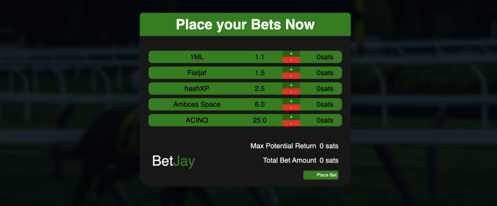

# BetJay

BetJay is a betting application built fully on the Lightning Network.




BetJay focuses on user privacy and ease of payment. It connects to an existing lightning node (service company node) to exchange
bitcoin (in satoshi) between the gambler and the service company based on win or lose.

## Features

- [x] A user may place a wager.
- [x] BetJay generates invoice
- [x] BetJay should display the invoice as a QR code for the user to pay.
- [x] BetJay listens for payment.
- [x] BetJay automatically places the bet upon payment confirmation.
- [x] If the bet is lost, BetJay allows the user to play again.
- [x] BetJay sends the profit amount to the gambler using Keysend
- [x] LND support

## Installation

BetJay connects to an [LND node](https://github.com/lightningnetwork/lnd/blob/master/docs/INSTALL.md), so a running LND node is required.
BetJay can easily run next to LND on the same host or any other hosting provider.

You need to have [Node](https://nodejs.org/en/download/) installed. Simply download the binary and run it!
Ensure the the below command runs

1. `$ node -v`
2. `$ npm -v`
3. `$ git clone https://github.com/omoniyi24/BetJay.git `

## Start Client
```
$ cd /BetJay/client
$ npm install
$ npm run start

```

## Start Server
```
$ cd /BetJay/server
$ npm install
$ npm run dev
```

**Note** : The BetJay server uses the LND details in the ./server/.env to connect to the LND node.
Please make sure to update the credentials. Also, the receiving node (user node) needs to allow
Keysend payment (checkout my post on https://medium.com/@omoniyi24/lightning-keysend-2df3fef4f4b4
for more on Keysend). By runs on port 3000 by default.

